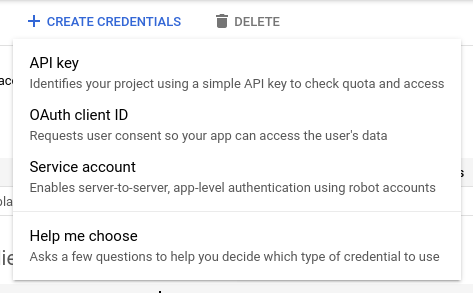
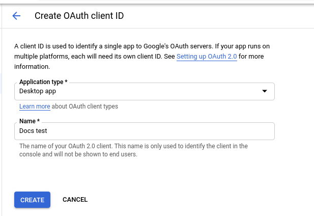
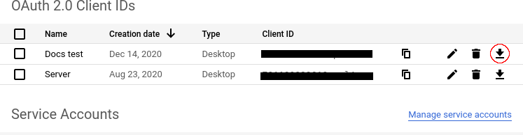

# Bring Back YouTube Email Notifications!

## Why?

In August 2020, YouTube removed the feature of sending email notifications when a subscriber uploads a video. Many watchers, myself included, prefer email notifications to app notifications. Here are some reasons why email notifications so great:

- Save videos for later
- Delete emails of videos you never want to watch
- Define filtering rules to automatically delete certain emails
- YouTube has been known to not always send notifications for all subscribers

This project aims to provide a replacement to YouTube's email notifications. Running this small program checks all your subscribers and sends emails with the links to new videos.

## How it works

It uses the [YouTube Data API](https://developers.google.com/youtube/v3/) to get a list of your subscribers and uses [RSS feeds](https://support.google.com/youtube/answer/6224202?hl=en) to get each channel's recent uploads. A database of videos for which an email has already been sent is kept in order to not notify about the same video twice. To send emails, the program connects to an email account through SMTP.

## Requirements

- [node.js](https://nodejs.org/en/) >= 14
- [git](https://git-scm.com/) (used during setup to download the project)

## Installation and setup

1. Download the source code

	```
	git clone https://github.com/MarcelRobitaille/bbyen.git
	```

1. Download packages

	```
	npm install --production
	```

1. Populate the `config.json` file

	```
	mv config.example.json config.json
	```

	Then update `email.host`, `email.auth`, and `email.sendingContact`. These are the settings to send email over SMTP.

	Change `email.destination` to the email address where videos should be sent.

	Optionally change `timers.subscriptions` and `timers.videos` to configure how often your list of subscriptions is updated and how often new videos are checked for emailed about respectively.

1. Set up Google API credentials

	The credentials have to be made on your personal account. This is the source of your subscriptions.

	1. Go to https://console.developers.google.com and create a new project

	1. Go to https://console.developers.google.com/apis/credentials and create OAuth 2.0 Client credentials

		1. Click "Create Credentials" and then "OAuth client ID"
		

		1. Select "Desktop app" for "Application type"
		

		1. Click "Create"

	1. Click the download button next to the new OAuth 2.0 Client ID.
	Download the credentials JSON file and save it as `google-credentials.json` in the folder where you downloaded the project.
	

	1. Go to https://console.developers.google.com/apis/library, search for and click "YouTube Data API v3", and enable this api.

## Running

Run the project with:
```
node src/index.js
```

On the first run, you will need to authenticate the app, tying it to your Google account (the subscriptions will come from whatever account you use):
1. A browser window should open automatically. If not, or if the system is headless, the URL will be printed in the console. Copy/paste it into a new tab.
1. Follow the instructions on this page.
1. You may have to click "Advanced" and "Got to bbyen (unsafe)". This is because the app hasn't been verified, but the server is trustworthy (you are running it).
1. After authenticating in the website, Google should automatically redirect you to your server, which will transfer the authentication code. In this case you will see a message "Authorization successful. You may now close this tab.".
If this does not work (if you see "Unable to connect"), please copy/paste the URL from the browser address bar into the console.

## Alternatives

It is possible to manually set up RSS feeds for each channel you are interested in. It is a very lengthy process.

1. Find the id of the channel.
1. Get the URL to the RSS feed: https://www.youtube.com/feeds/videos.xml?channel_id=<channelId\>
1. Put this URL in an RSS reader (such as [blogtrottr.com](https://blogtrottr.com))

Here are some advantages of BBYEN over manually configuring RSS feeds:

- No ads.
- You don't have to manually go through all your subscriptions. It will automatically find all subscriptions you have notifications for.
- It will automatically detect new subscriptions and unsubscriptions.
